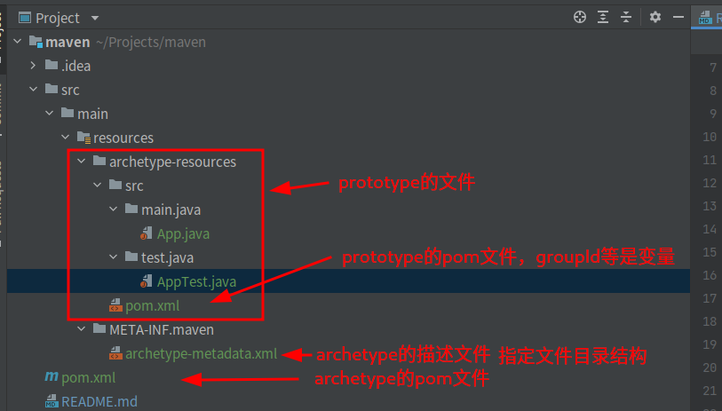

# maven
maven

### maven是什么

一个依赖管理、项目构建工具。包含中央仓库.
按照约定统一构建方式。

### 一、创建自己的 archetype maven模板
新建一个项目一般使用一个maven插件原型(archetype)模板。在模板满足要求的情况下也可以自己创建自己的模板.
官方文档：https://maven.apache.org/guides/mini/guide-creating-archetypes.html

archetype是一个非常简单的artifact.它包含你需要创建的project结构原型(prototype).
它主要有以下几个部分组成：
    1. archetype描述文件（位于`src/main/resources/META_INF/maven`目录下的`archetype-metadata.xml`）.
描述文件里按照分类将要包含到archetype中的文件，这样方便maven archetype生成机制正确的生成对应的archetype插件.
    2. archetype plugin拷贝的原型(prototype)文件.(`src/main/resources/archetype-resources/`目录下的所有文件).
    3. 原型(prototype)的pom文件（位于`src/main/resources/archetype-resources/`的`pom.xml`文件）.
    4. archetype的pom文件（位于archetype项目的根目录）.

#### 1.1 新建一个项目和archetype artifact的pom.xml文件
```xml
<project xmlns="http://maven.apache.org/POM/4.0.0" xmlns:xsi="http://www.w3.org/2001/XMLSchema-instance"
         xsi:schemaLocation="http://maven.apache.org/POM/4.0.0 https://maven.apache.org/xsd/maven-4.0.0.xsd">
    <modelVersion>4.0.0</modelVersion>
    <groupId>cn.tocute</groupId>
    <artifactId>maven</artifactId>
    <version>1.0-SNAPSHOT</version>
    <packaging>maven-archetype</packaging>

    <build>
        <extensions>
            <extension>
                <groupId>org.apache.maven.archetype</groupId>
                <artifactId>archetype-packaging</artifactId>
                <version>3.1.1</version>
            </extension>
        </extensions>
    </build>
</project>
```
需要修改上面pom文件中`groupId`、`artifactId`、`version`, 后边运行命令`archetype:generate`(用来生成archetype)需要指定这三个参数。


#### 1.2 创建 archetype的描述文件`archetype-metadata.xml`

archetype的描述文件是`src/main/resources/META-INF/maven/archetype-metadata.xml`,下面是一个该文件的示例：
```xml
<archetype-descriptor xmlns="http://maven.apache.org/plugins/maven-archetype-plugin/archetype-descriptor/1.1.0"
                      xmlns:xsi="http://www.w3.org/2001/XMLSchema-instance"
                      xsi:schemaLocation="http://maven.apache.org/plugins/maven-archetype-plugin/archetype-descriptor/1.1.0
                      https://maven.apache.org/xsd/archetype-descriptor-1.1.0.xsd" name="maven">
    <fileSets>
        <fileSet filtered="true" packaged="true">
            <directory>src/main/java</directory>
        </fileSet>
        <fileSet>
            <directory>src/test/java</directory>
        </fileSet>
    </fileSets>
</archetype-descriptor>
```
上面的`archetype-descriptor`标签(tag)的 `name属性（attribute）`必须等于上一步中的`artifactId`,这里是`maven`.

常用的tag有：
<requiredProperties>    需要的配置文件，列出从该archetype生成项目需要的配置文件.
<fileSets>              文件组定义
<modules>               模块定义

到这一步，通过上述描述文件可以指定需要创建的单个文件(不能是空目录）.

#### 1.3 创建prototype的文件和prototype的pom文件
这一步，要创建的archetype组件是prototype的pom.xml文件(),示例：
```xml
<project xmlns="http://maven.apache.org/POM/4.0.0" xmlns:xsi="http://www.w3.org/2001/XMLSchema-instance"
         xsi:schemaLocation="http://maven.apache.org/POM/4.0.0 https://maven.apache.org/xsd/maven-4.0.0.xsd">
    <modelVersion>4.0.0</modelVersion>

    <groupId>${groupId}</groupId>
    <artifactId>${artifactId}</artifactId>
    <version>${version}</version>
    <packaging>jar</packaging>

    <name>${artifactId}</name>
    <url>http://www.myorganization.org</url>

    <dependencies>
        <dependency>
            <groupId>junit</groupId>
            <artifactId>junit</artifactId>
            <version>4.12</version>
            <scope>test</scope>
        </dependency>
    </dependencies>
</project>
```
不要忘了把`artifactId`、`groupId`和`version`设置为变量：`${artifactId}`、`${groupId}`和`${version}`.
(因为我们是在完成一个项目原型模板，给别的项目新建的时候使用)

到这里的目录结构如下图：


#### 1.4 安装自定义的archetype 并且运行archetype插件

到这里可以通过命令安装此archetype插件
```shell
mvn install
```

好了，到这里就成功创建了archetype,那么如何使用呢？

必须指定`groupId`、`artifactId`和`version`,version如果没有指定会默认为`RELEASE`的版本（没有就报错了）
```shell
mvn archetype:generate                                  \
  -DarchetypeGroupId=<archetype-groupId>                \
  -DarchetypeArtifactId=<archetype-artifactId>          \
  -DarchetypeVersion=<archetype-version>                \
  -DgroupId=<my.groupid>                                \
  -DartifactId=<my-artifactId>
```

回到项目目录中，新建一个 cn.tocute.newProject的项目
即
```shell
mvn archetype:generate                                  \
  -DarchetypeGroupId=cn.tocute                          \
  -DarchetypeArtifactId=maven                           \
  -DarchetypeVersion=1.0-SNAPSHOT                       \
  -DgroupId=cn.tocute                                \
  -DartifactId=newProject
```
可以看到运行成功后，在目录中创建了一个newProject的项目，其项目结构和之前在archetype中定义的一样。


检查没有问题后，可以将自己的archetype发布到maven(这就是另一节课程了).

> 注意区分的几个名词 archetype prototype 
> 其他名词 artifact attribute(属性，这里指xml中tag的属性)


